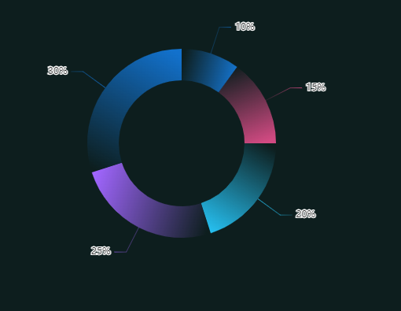

# Echarts 环形渐变图
#### 如果对你有帮助，请帮我点个 star
#### 只需要提供原始数据（例 data: [2,3,4,5,6] ），不需要关心开始角度/结束角度之类的，拿来就可以用

1.需求需要实现上图的效果，找了一圈网上的demo很少，没找到一个完全能跑并符合需求的demo

2.本项目是直接用html写了个demo放出来，（直接运行本项目的index.html就可以看到效果）

3.本项目参考 [玩转ECharts之实现“环形渐变”](https://zhuanlan.zhihu.com/p/183893861)(由于我看的时候文章中的链接均已失效，并且代码不是完全的，所以自己整了个完全的demo放出来)。

原文里面没有讲如何获取开始角度（startArc）和结束角度（endArc）的计算方式，我后面找到d3的api里面是有这个计算方法的[d3.pie()](https://d3js.org.cn/document/d3-shape/#pies)，
所以将d3的pie.js直接放在本地，就实现了通过数据计算开始角度和结束角度，然后通过角度计算渐变的坐标，就达到了多数据动态环形渐变的效果

